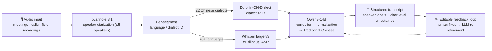

# YaYan-AI（雅言）


> **Fully-offline multi-dialect speech intelligence system.**
> Converts speech across **22 Chinese dialects and 40+ world languages** into structured
> Traditional-Chinese transcripts — with speaker diarization, character-level timestamps,
> and an LLM-assisted correction loop. Designed for **air-gapped, privacy-critical
> environments**: no cloud, no API calls, no data leaving the machine.

---

## Why YaYan-AI

Off-the-shelf ASR works for Mandarin and English. It falls apart on **low-resource
Chinese dialects** — Hokkien (Taiwanese), Hakka, Wu, Cantonese variants — exactly the
speech that matters in real-world field recordings, call archives, and oral-history
preservation. And in privacy-critical settings, shipping audio to a cloud API is not
an option at all.

YaYan-AI solves both: state-of-the-art dialect recognition, running entirely on
local GPUs.

## Pipeline Architecture



**Design decisions that matter:**
- **Per-segment language ID** — a single conversation can mix Mandarin, Hokkien and
  English; routing each segment independently prevents one dominant language from
  swallowing the others.
- **Two-stage ASR routing** — a dialect-specialized model (Dolphin) for Chinese variants,
  Whisper large-v3 for everything else; each model does only what it is best at.
- **LLM correction stage** — Qwen3-14B normalizes ASR output into readable Traditional
  Chinese and fixes dialect-specific transcription artifacts.
- **Human-in-the-loop** — user edits feed back into the correction stage, so accuracy
  improves on *your* audio domain over time.

## Features

| Capability | Detail |
|---|---|
| Chinese dialects | 22 — Mandarin, Cantonese, Hokkien/Taiwanese, Hakka, Wu (Shanghai/Suzhou/Wenzhou), Hunanese, … |
| World languages | 40+ via Whisper large-v3 (JA / KO / EU / SEA / ME) |
| Speaker diarization | Up to 5 speakers (A–E), pyannote 3.1 |
| Timestamps | Character-level |
| Output | Structured Traditional-Chinese transcript, per-speaker |
| Correction | Qwen3-14B two-stage + editable feedback loop |
| Deployment | 100 % offline — air-gapped & privacy-critical environments |
| Interface | Gradio web UI · batch mode (`auto_batch.py`) |

## Requirements

| Component | Spec |
|---|---|
| OS | Ubuntu 22.04+ |
| GPU | 2× NVIDIA — primary: **RTX 6000 24 GB** (`app_rtx6000.py`) · also supported: **RTX 4000 Ada 20 GB** (`app_rtx4000.py`) |
| Driver / CUDA | 535+ / CUDA 12.1 |
| Python | 3.10 |
| Disk | ~50 GB (models ≈ 19 GB + workspace) |
| RAM | 32 GB+ |

Core stack: PyTorch 2.3.1 · transformers 4.51.3 · pyannote.audio 3.1 · Gradio 4.44

## Quickstart

```bash
git clone https://github.com/wu840407/YaYan-AI.git
cd YaYan-AI
pip install -r requirements.txt

# Download models (online phase; the system runs fully offline afterwards)
bash scripts/download_models.sh
python scripts/verify_models.py

# Launch — pick the profile matching your GPUs
python app_rtx6000.py     # dual RTX 6000 (primary) → Gradio UI on http://localhost:7860
python app_rtx4000.py     # dual RTX 4000 Ada

# Batch mode
bash scripts/start_batch.sh
```

For fully air-gapped installation, see `scripts/install_offline.sh` and
`scripts/verify_offline.py`.

## Performance

| Category | Accuracy | Note |
|---|---|---|
| Standard Mandarin | ~99% | Character-level |
| Chinese dialects | ~75% | Bounded by current model size on dual 20–24 GB GPUs |

The dialect gap is primarily a model-capacity constraint. Accuracy improvements
are on the roadmap below (larger models on H200 hardware + dialect-specific
term-bank and corpora).

## Roadmap

- [ ] Larger models on H200 ×2 hardware to lift dialect accuracy (2026 H2)
- [ ] RAG term-bank for domain / dialect vocabulary
- [ ] Fine-tuning on public academic dialect corpora
- [ ] Kafka-based high-throughput batch pipeline
- [ ] Streaming (real-time) mode

## License & Author

MIT — see [`LICENSE`](LICENSE). Model weights retain their respective upstream licenses (see [`NOTICE.md`](NOTICE.md)).

Maintained by [ChengRung Wu](https://wu840407.github.io) ([@wu840407](https://github.com/wu840407)).
Questions and issues welcome.

---

## 中文說明（摘要）

**雅言 YaYan-AI** 是全離線的多方言語音辨識系統：22 種漢語方言＋40+ 種語言 → 繁體中文逐字稿，
含語者分離（至多 5 人）、字元級時間戳、Qwen3-14B 校正與可編輯回饋迴路。
專為**離線、隱私敏感環境**設計——不連雲端、資料不出機器。

架構：pyannote 3.1 分離語者 → 逐段語言判定 → Dolphin（漢語方言）/ Whisper large-v3（外語）→ Qwen3-14B 校正輸出繁中逐字稿。
雙 GPU 設定檔：RTX 4000 Ada（`app_rtx4000.py`）／RTX 6000（`app_rtx6000.py`）。
